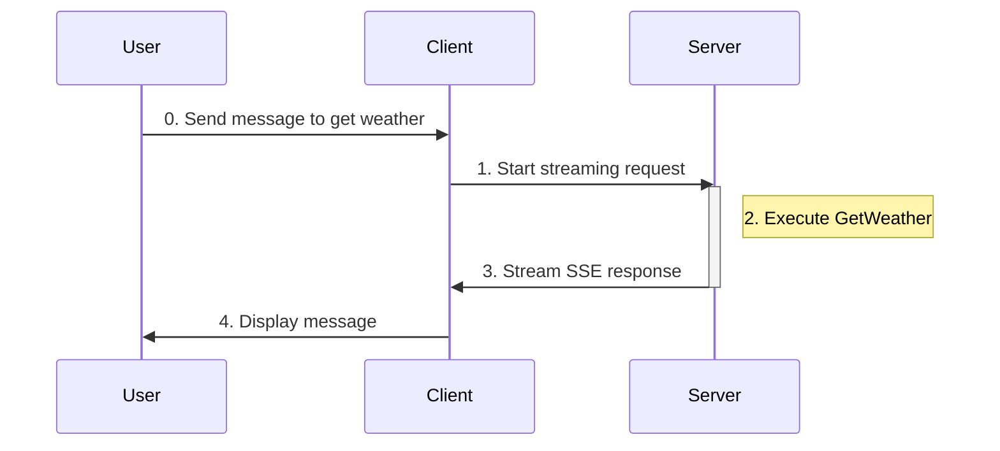
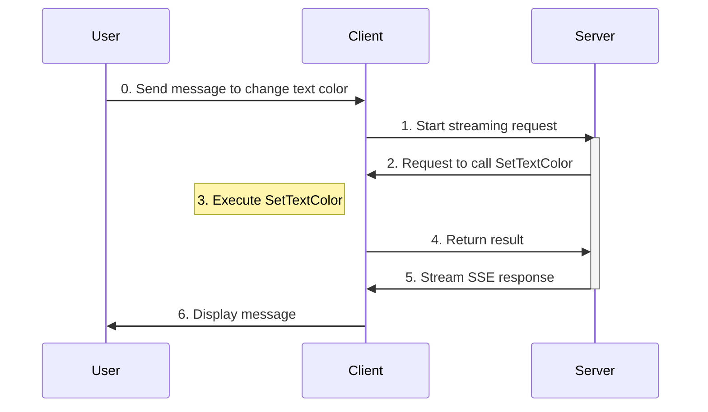

# Tools

This tutorial shows you how to add **function tools** to your AG-UI agents. 

Function tools are custom C# methods that an agent can call to perform specific tasks, e.g., retrieving data, interacting with external systems, or performing UI-related actions.

Tools are split into **backend tools** and **frontend tools**, depending on where they are defined.

## Backend tools

Backend tools are defined and executed on the **server**.

The agent decides when to call these tools, executes them on the server and the results are automatically streamed back to the client. Backend tools are ideal for data access, server-side logic, and interacting with external systems.

### Creating a backend tool:

There's already a backend tool, i.e., `WeatherBackendTool.GetWeather`, defined on the server.


### Using the backend tool:

In the same console, ask the agent for **the weather in any city**.

<details>
<summary>
Here's an example of the interaction:
</summary>


</details>

### What's happening?



When you send a message to get the weather for a location:

1. The client sends the request to the server via HTTP (`RunStreamingAsync`).
2. The server determines the arguments and executes `WeatherBackendTool.GetWeather`.
3. The server incorporates the result into the agent response and streams it back to the client via SSE.
4. The client displays the message to you.


## Frontend tools

Frontend tools are defined and executed on the **client**.

The agent decides when to call these tools, but their execution happens entirely on the client. Frontend tools are ideal for UI operations, client-specific data, and interactions with the local system.

### Creating a frontend tool

Add this tool to change the console text color to `Program.cs` in the `Client` folder:
``` C#
[Description("Change the console text color into the specified color.")]
string SetTextColor(string color)
{
    if (Enum.TryParse<ConsoleColor>(color, out var parsedColor))
    {
        Console.ForegroundColor = parsedColor;
        currentTextColor = parsedColor;
        return $"Console text color changed to {parsedColor}.";
    }
    else
    {
        throw new ArgumentException($"Invalid console colour '{color}'", nameof(color));
    }
}
```

Make it an `AIFunction` somewhere before the agent is declared::
``` C#
AIFunction setTextColorTool = AIFunctionFactory.Create(SetTextColor);
```

Then, <a name="client-registration">add the tool to the agent</a>:
``` C#
AIAgent agent = chatClient.AsAIAgent(
    name: "agui-client",
    description: "AG-UI Client Agent",
    tools: [setTextColorTool]);
```

Add instruction for the agent when using the client tool:
``` C#
List<ChatMessage> messages =
[
    new(ChatRole.System, "When asked to return a color for the console foreground, choose the closest one from the ConsoleColor enum and return with CamelCase."),
];
```

Add these two else-if conditions to the `AIContent` foreach loop so you can see when the function is called, what arguments are passed in, and what result the function returns:
``` C#
                else if (content is FunctionCallContent functionCallContent)
                {                    
                    var argsJson = JsonSerializer.Serialize(
                        functionCallContent.Arguments,
                        new JsonSerializerOptions { WriteIndented = true }
                    );
                    Console.ForegroundColor = ConsoleColor.DarkGray;
                    Console.WriteLine($"\n[Function Call: {functionCallContent.Name}]\nArguments:\n{argsJson}");
                    Console.ForegroundColor = currentTextColor;
                }
                else if (content is FunctionResultContent functionResultContent)
                {
                    Console.ForegroundColor = ConsoleColor.DarkGray;
                    Console.WriteLine($"\n[Function Result: {functionResultContent.Result}]");
                    Console.ForegroundColor = currentTextColor;
                }
```
### Using the frontend tool

> [!IMPORTANT]
> Before running the client, ensure the server is running at `http://localhost:5000`.
>
> You can do this by running this in the `Server` folder:
> ```
> dotnet run --urls http://localhost:5000
> ```

Quit and start the client again.
> To quit, type `:q` in the console.
> 
> Then, run this in the `Client` folder to start it again:
> ``` bash
> dotnet run
> ```

Now, ask the agent to **change the console text color**.

<details>
<summary>
Here's an example of the interaction:
</summary>


</details>


### What's happening?



When you send a message to change the console text color:
1. The client sends the request to the server via HTTP (`RunStreamingAsync`).
2. The server sends the tool call request to the client.
3. The client executes `SetTextColor` using the arguments provided by the server.
4. The client returns the result of `SetTextColor` to the server as `FunctionResultContent`.
5. The server incorporates the result into the agent response and streams it back to the client via SSE.
6. The client displays the message to you.

> [!NOTE]
>
> The server does not know any implementation details of frontend tools. It only knows:
> 1. Tool names and description ([here](#client-registration))
> 2. Parameters schemas
> 3. When to request tool execution
