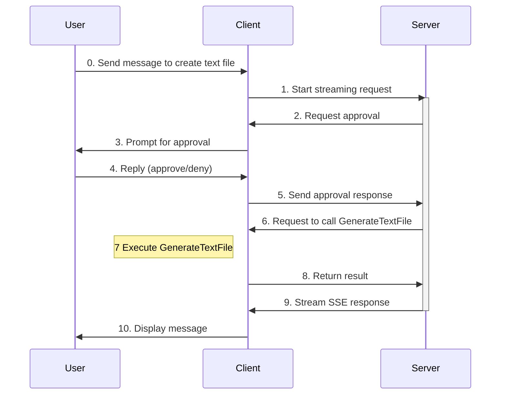

# Human-in-the-Loop

This tutorial shows you how to add  **function tools that require human approval** to your AG-UI agents. 

This pattern, known as **human-in-the-loop**, is used whenever an agent needs user input, e.g., to approve or reject an action. 

When approval is required, the agent run stops and returns a response indicating what input is required. The client is responsible for collecting that input from the user and resuming the agent run with the user’s response.


## Create a tool with human-in-the-loop approval

> [!TIP]
>
> `FunctionApprovalRequestContent` and `ApprovalRequiredAIFunction` are for evaluation and may change or be removed in future updates. They will be highlighted with a warning (similar to a syntax error) in your editor. 
>
> To ignore this warning, create an `.editorconfig` file in the `AGUI` folder with the following content: 
>
> ```
> [*.cs]
> # MEAI001: Type is for evaluation purposes only and is subject to change or removal in future updates. Suppress this diagnostic to proceed.
> dotnet_diagnostic.MEAI001.severity = none
> ```

Add this tool to generate a text file to `Program.cs` in the `Client` folder:
```C#
[Description("Generate a text file with the specified filename and content.")]
string GenerateTextFile(
    [Description("The filename to generate")] string filename,
    [Description("The content to write to the file")] string content)
{
    string projectRoot = Path.GetFullPath(Path.Combine(AppContext.BaseDirectory, "..", "..", ".."));
    string filePath = Path.Combine(projectRoot, filename);

    File.WriteAllText(filePath, content);

    return $"File written to: {filePath}";
}
```

Make it an `AIFunction` that requires approval by wrapping it around `ApprovalRequiredAIFunction` somewhere before the agent is declared:
```C#
AIFunction approvalRequiredGenerateTextFileTool = new ApprovalRequiredAIFunction(AIFunctionFactory.Create(GenerateTextFile));
```

Then, add the tool to the agent:
```C#
AIAgent agent = chatClient.AsAIAgent(
    name: "agui-client",
    description: "AG-UI Client Agent",
    tools: [setTextColorTool, 
            approvalRequiredGenerateTextFileTool]);
```

Create a helper method that handles the approval response:
```C#
async Task HandleFunctionApprovalResponse(AIAgent agent, ChatMessage message)
{
    await foreach (AgentResponseUpdate update in agent.RunStreamingAsync(message))
    {
        Console.Write(update.Text);
    }
    awaitingApproval = false;
}
```

Add this `else-if` condition to the `AIContent` foreach loop to take care of the function approval:
```C#
                else if (content is FunctionApprovalRequestContent request)
                {
                    var input = message.Trim().ToLowerInvariant();
                    if (input == "approve" || input == "a" || input == "yes" || input == "y")
                    {
                        var approvalMessage = new ChatMessage(ChatRole.User, [request.CreateResponse(true)]);
                        Console.ForegroundColor = ConsoleColor.Green;
                        await HandleFunctionApprovalResponse(agent, approvalMessage);
                        Console.ForegroundColor = currentTextColor;
                    }
                    else if (input == "deny" || input == "d" || input == "no" || input == "n")
                    {
                        var denialMessage = new ChatMessage(ChatRole.User, [request.CreateResponse(false)]);
                        Console.ForegroundColor = ConsoleColor.Red;
                        await HandleFunctionApprovalResponse(agent, denialMessage);
                        Console.ForegroundColor = currentTextColor;
                    }
                    else
                    {
                        var argsJson = JsonSerializer.Serialize(
                            request.FunctionCall.Arguments,
                            new JsonSerializerOptions { WriteIndented = true }
                        );
                        Console.ForegroundColor = ConsoleColor.Blue;
                        Console.WriteLine($"\nPlease confirm that you'd like to create the text file with the following details:\n{argsJson}");
                        Console.ForegroundColor = currentTextColor;
                        awaitingApproval = true;
                    }
                }
```

## Invoke the tool with human-in-the-loop approval:

> [!IMPORTANT]
> Before running the client, ensure the server is still running at `http://localhost:5000`.
>
> If not, from the `Server` folder:
> ```bash
> dotnet run --urls http://localhost:5000
> ```
> **Keep this terminal open.**

If your console app is still running from before, quit it by typing `:q`. 

Then, from the same `Client` folder:
```bash
dotnet run
```

Now, ask the agent to **create a text file**.

<details>
<summary>
Here's an example of the interaction:
</summary>


</details>


## What's happening?



When you send a message to generate a text file:
1. The client sends the request to the server via HTTP (`RunStreamingAsync`).
2. The server requests tool execution approval (`FunctionApprovalRequestContent`) from the client.
3. The client prompts the user for approval.
4. The user approves or denies the request.
5. The client converts the user's decision into a `FunctionApprovalResponseContent` and sends it back to the server.
6. The server sends the tool call request to the client.
7. The client executes `GenerateTextFile` using the arguments provided by the server.
8. The client returns the result of `GenerateTextFile` to the server as `FunctionResultContent`.
9. The server incorporates the result into the agent response and streams it back to the client via SSE.
10. The client displays the message to you.
