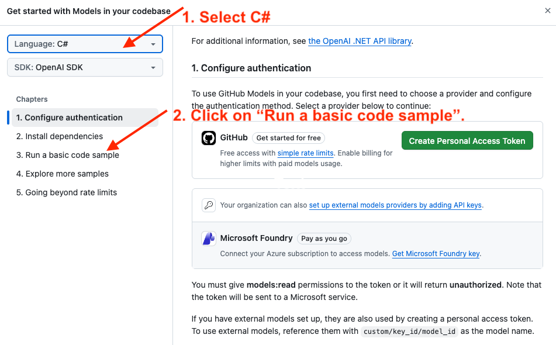
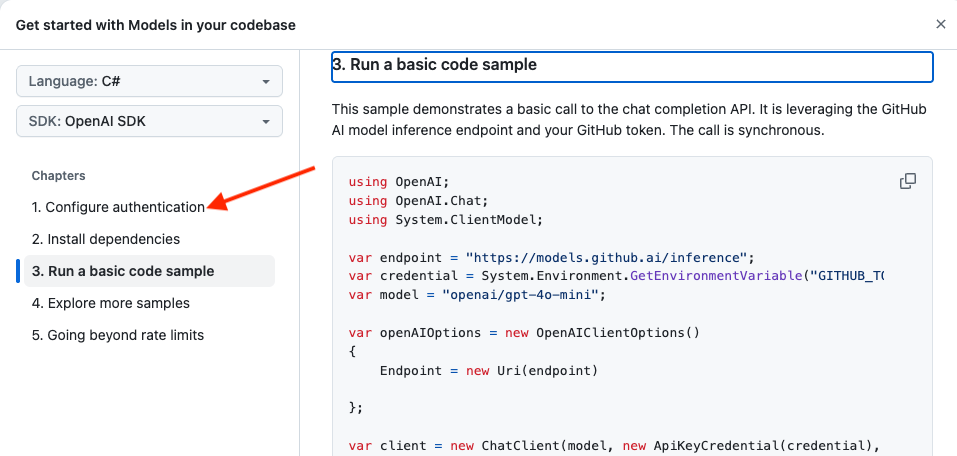
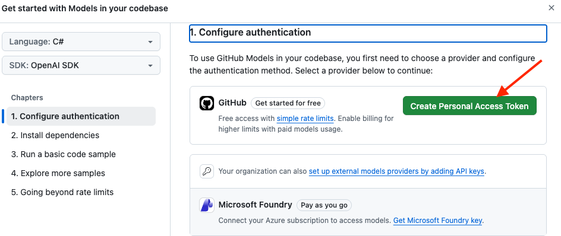
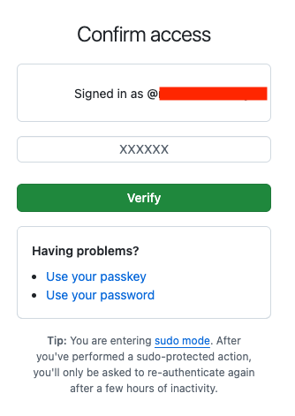
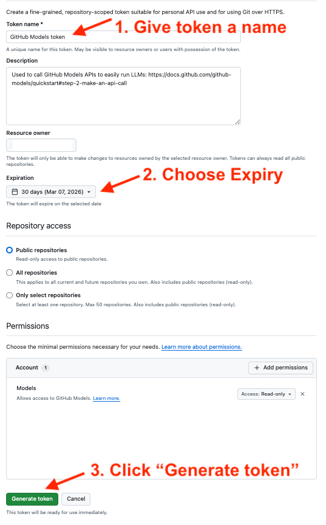
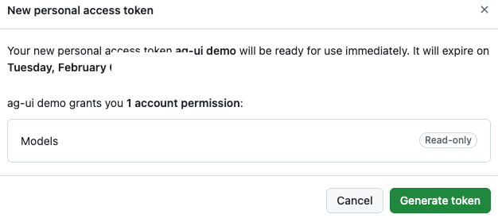
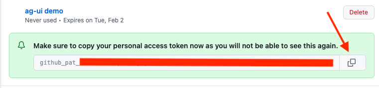

# Get Personal Access Token from GitHub

You will need to use an AI Model in order to build the AG-UI server. In today's workshop, we will be using a AI Model hosted at GitHub, which is free for developers. 

Follow these instructions to get a GitHub Personal Access Token (PAT).

### Starting Point
Visit GitHub at https://github.com/marketplace?type=models to work with free GitHub AI Models. At the time of writing, these are a subset of the models available:

### Select Model
Click on the `Most Popular` tab.

We will be using the `gpt-4o-mini` model. Scroll down until you find `OpenAO GPT-4o mini`.

Selecting the `OpenAI GPT-4o mini` leads you to the page below. 

Click on the `<> Use this model` button.

### Select Language
Once the dialog pops up, select `C#`, then click on `3. Run a basic code sample`.

### Find Model Signature
On the next dialog, you will see the signature of the model. In our case it is `openai/gpt-4o-mini`.

### Configure authentication
Click on `1. Configure authentication`.

### Create Personal Access Token
Next, click on the green `Create Personal Access Token` button.

You may need to go through a verification process.

Make selections, then click on `Generate token`.

### Generate token
On the next pop-up, click on `Generate token` to confirm.

### Save token
Copy the newly generated token and place it is a safe place because you cannot view this token again once you leave this page. 
