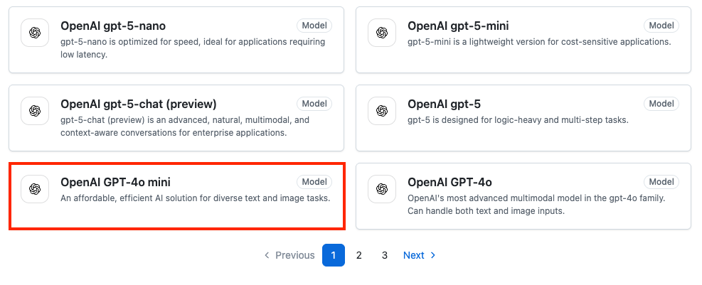
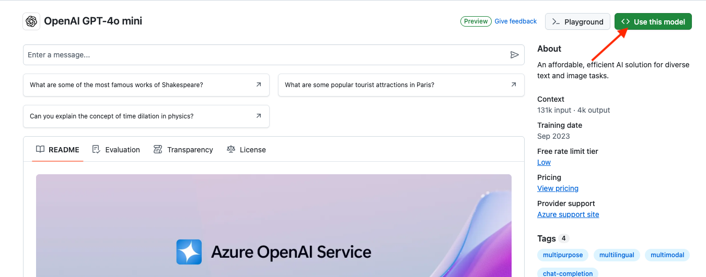
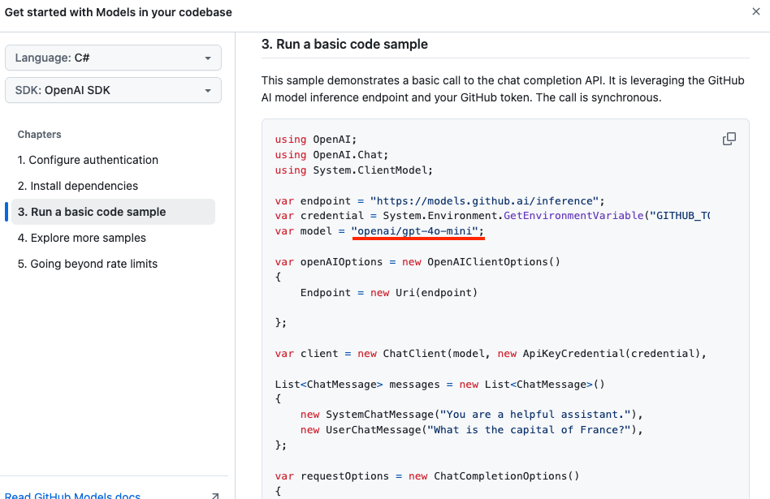

# Get Personal Access Token from GitHub

You will need to use an AI Model in order to build the AG-UI server. In today's workshop, we will be using a AI Model hosted at GitHub, which is free for developers. 

Follow these instructions to get a GitHub Personal Access Token (PAT).

The starting point is to visit your GitHub repo at https://github.com/marketplace?type=models to work with free GitHub AI Models. At the time of writing, these are a subset of the models available:

Click on the _Most Popular_ tab.

We will be using the _gpt-4o-mini_ model. Scroll down until you find _OpenAO GPT-4o mini_.

Selecting the "OpenAI GPT-4o mini" leads you to the page below. 

Click on the _<> Use this model_ button.

On the dialog that pops up, select _C#_, then click on _Run a basic code sample_.

On the next dialog, you will see the signature of the model. In our case it is _openai/gpt-4o-mini_.

Click on _1. Configure authentication_.

Next, click on the green _Create Personal Access Token_ button.

You may need to go through a verification process.

Make selections, then click on _Generate token_.

On the next pop-up, click on _Generate token_ to confirm.

Copy the newly generated token and place it is a safe place because you cannot view this token again once you leave this page. 
