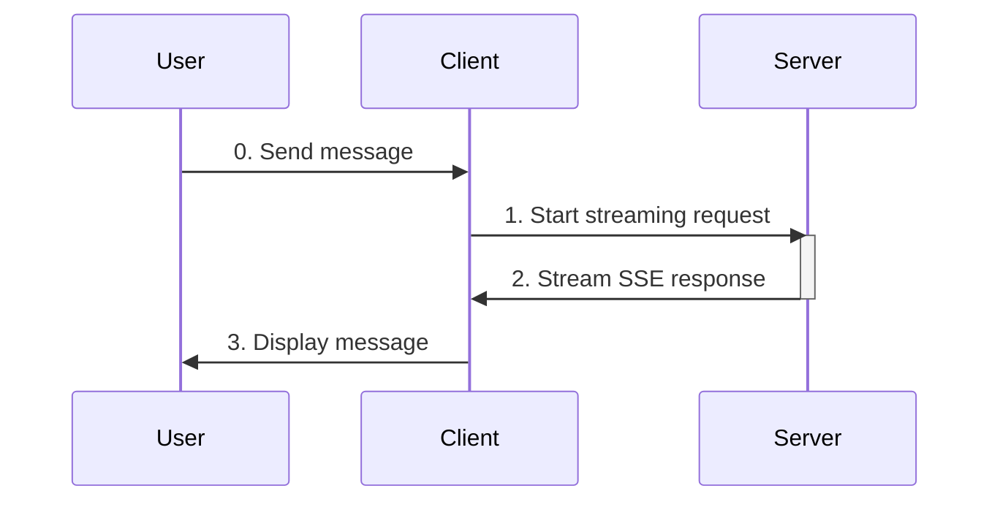

# Client Setup

The AG-UI client connects to the server and display streaming responses.

### Creating the client

Inside the AGUI folder, create a console project:
``` bash
dotnet new console -o Client
dotnet sln add ./Client/Client.csproj
```

Install the required packages for the client:

``` bash
cd Client
dotnet add package Microsoft.Agents.AI.AGUI --version 1.0.0-preview.260128.1
dotnet add package Microsoft.Agents.AI --version 1.0.0-preview.260128.1
cd ..
```

Replace `Program.cs` with this:
``` C#
using Microsoft.Agents.AI;
using Microsoft.Agents.AI.AGUI;
using Microsoft.Extensions.AI;
using System.ComponentModel;
using System.Text.Json;

string serverUrl = Environment.GetEnvironmentVariable("AGUI_SERVER_URL") ?? "http://localhost:5000";
Console.WriteLine($"Connecting to AG-UI server at: {serverUrl}\n");

// Create the AG-UI client agent
using HttpClient httpClient = new()
{
    Timeout = TimeSpan.FromSeconds(60)
};

AGUIChatClient chatClient = new(httpClient, serverUrl);
AIAgent agent = chatClient.AsAIAgent(
    name: "agui-client",
    description: "AG-UI Client Agent");

List<ChatMessage> messages = [];
AgentSession session = await agent.GetNewSessionAsync();

ConsoleColor currentTextColor = Console.ForegroundColor;
Console.Write("\nEnter your message or :q to quit.\n");
string regularPrompt = "\n> ";
string approvalPrompt = "\nApprove execution? (approve/deny): ";
bool awaitingApproval = false;

try
{
    while (true)
    {
        // Get and validate user input
        Console.Write(awaitingApproval ? approvalPrompt : regularPrompt);
        string? message = Console.ReadLine();

        if (string.IsNullOrWhiteSpace(message))
        {
            Console.WriteLine("Request cannot be empty.");
            continue;
        }
        if (message.ToLowerInvariant() is ":q" or "quit")
        {
            break;
        }

        messages.Add(new ChatMessage(ChatRole.User, message));

        // Stream and print the response
        await foreach (AgentResponseUpdate update in agent.RunStreamingAsync(messages, session))
        {
            foreach (AIContent content in update.Contents)
            {
                if (content is TextContent textContent)
                {
                    Console.Write(textContent.Text);
                }
            }
        }
    }
}
catch (Exception ex)
{
    Console.WriteLine($"\nAn error occurred: {ex.Message}");
}
```

### Running the client

> [!IMPORTANT]
> Before running the client, ensure the server is running at `http://localhost:5000`.
>
> Do this by running the following in the `Server` folder:
> ```
> dotnet run --urls http://localhost:5000
> ```

Start the client.
> Run this in the `Client` folder to start it:
> ``` bash
> dotnet run
> ```

And, ask the agent anything!

<details>

<summary>
Here's an example of the interaction:
</summary>


</details>

### What's happening?



When you send a message in the console:
1. The client sends the request to the server via HTTP (`RunStreamingAsync`).
2. The server streams the agent response back to the client via SSE.
3. The client displays the message to you.


