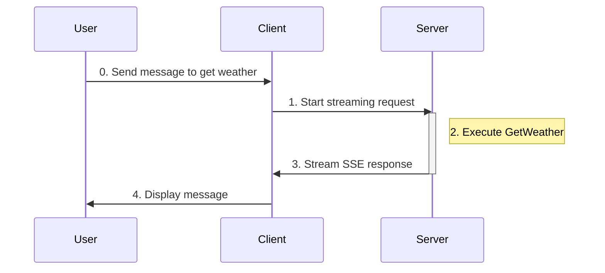
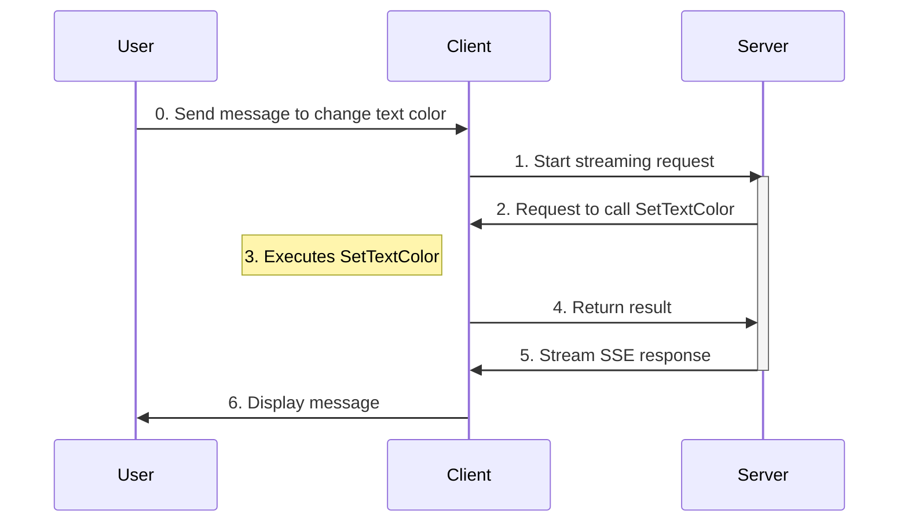

# Tools

## Backend tools

### Creating backend tools:

There's already a backend tool (that gets the weather) defined on the server. 

### Calling backend tools:

You can simply ask for the weather in the same console to call it.

<details>
<summary>
here's an example of the interaction:
</summary>


</details>

### What's happening?



When you send a message to get the weather for a location:

1. The client sends the request to the server via HTTP (`RunStreamingAsync`).
2. The server determines the arguments and executes `WeatherBackendTool.GetWeather`.
3. The server incorporates the result into the agent response and streams it back to the client via SSE.
4. The client displays the message to you.


## Frontend tools

### Creating frontend tools:

add this tool to the Program.cs in the client folder:
``` C#
[Description("Change the console foreground color into the specified color.")]
void SetTextColor(string color)
{
    if (Enum.TryParse<ConsoleColor>(color, out var parsedColor))
    {
        currentColor = parsedColor;
        Console.ForegroundColor = parsedColor;
    }
    else
    {
        throw new ArgumentException($"Invalid console colour '{color}'", nameof(color));
    }
}
```

make it an `AIFunction`:
``` C#
AIFunction setTextColorTool = AIFunctionFactory.Create(SetTextColor);
```

<a name="client-registration">add the tool to the agent</a>:
``` C#
AIAgent agent = chatClient.AsAIAgent(
    name: "agui-client",
    description: "AG-UI Client Agent",
    tools: [setTextColorTool]);
```

add instruction for the agent when using the client tool:
``` C#
List<ChatMessage> messages =
[
    new(ChatRole.System, "When asked to return a color for the console foreground, choose the closest one from the ConsoleColor enum and return with CamelCase."),
];
```

add these two else-if conditions to the `AIContent` foreach loop so you'd know when the function is called, what arguments are passed in, and what result the function return:
``` C#
                else if (content is FunctionCallContent functionCallContent)
                {                    
                    var argsJson = JsonSerializer.Serialize(
                        functionCallContent.Arguments,
                        new JsonSerializerOptions { WriteIndented = true }
                    );
                    Console.ForegroundColor = ConsoleColor.DarkGray;
                    Console.WriteLine($"\n[Function Call: {functionCallContent.Name}]\nArguments:\n{argsJson}");
                    Console.ForegroundColor = currentTextColor;
                }
                else if (content is FunctionResultContent functionResultContent)
                {
                    Console.ForegroundColor = ConsoleColor.Gray;
                    Console.WriteLine($"\n[Function Result: {functionResultContent.Result}]");
                    Console.ForegroundColor = currentTextColor;
                }      
```
### Calling frontend tools:

run this to start the client again
``` bash
dotnet run
```

And you can simply ask for it to change the console foreground color.

<details>
<summary>
here's an example of the interaction:
</summary>


</details>


### What's happening?



When you send a message to change the console text color:
1. The client sends the request to the server via HTTP (`RunStreamingAsync`).
2. The server sends the tool call request to the client.
3. The client executes `SetTextColor` using the arguments provided by the server.
4. The client returns the result of `SetTextColor` to the server as `FunctionResultContent`.
5. The server incorporates the result into the agent response and streams it back to the client via SSE.
6. The client displays the message to you.

> [!NOTE]
>
> The server doesn't know any implementation details of frontend tools. It only knows:
> 1. Tool names and description ([here](#client-registration))
> 2. Parameters schemas
> 3. When to request tool execution