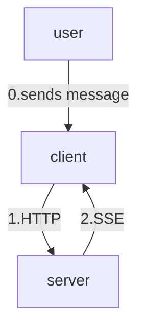

# Client Setup

create a new project
``` bash
dotnet new console -o CLI_Client
```

cd into the directory, and run these to install the required packages

``` bash
dotnet add package Microsoft.Agents.AI.AGUI --prerelease
dotnet add package Microsoft.Agents.AI --prerelease
```

replaced Program.cs with this
``` c# 
using Microsoft.Agents.AI;
using Microsoft.Agents.AI.AGUI;
using Microsoft.Extensions.AI;

string serverUrl = "http://localhost:5000";

// Create the AG-UI client agent
using HttpClient httpClient = new()
{
    Timeout = TimeSpan.FromSeconds(60)
};

AGUIChatClient chatClient = new(httpClient, serverUrl);

AIAgent agent = chatClient.AsAIAgent();

AgentSession session = await agent.GetNewSessionAsync();
List<ChatMessage> messages = [];

try
{
    while (true)
    {
        // Get user input
        Console.Write("\nUser (:q or quit to exit): ");
        string? message = Console.ReadLine();

        // Validate message
        if (string.IsNullOrWhiteSpace(message))
        {
            Console.WriteLine("Request cannot be empty.");
            continue;
        }
        if (message is ":q" or "quit")
        {
            break;
        }

        messages.Add(new ChatMessage(ChatRole.User, message));

        await foreach (AgentResponseUpdate update in agent.RunStreamingAsync(messages, session))
        {
            // Display streaming text content
            foreach (AIContent content in update.Contents)
            {
                if (content is TextContent textContent)
                {
                    Console.Write(textContent.Text);
                }
            }
        }
    }
}
catch (Exception ex)
{
    Console.WriteLine($"\nAn error occurred: {ex.Message}");
}
```

run this to start the client
``` bash
dotnet run
```

<details>

<summary>
here's an example of the interaction:
</summary>

``` console
$ dotnet run
Connecting to AG-UI server at: http://localhost:8888

User (:q or quit to exit): What is 2 + 2?

2 + 2 equals 4.

User (:q or quit to exit): Tell me a fun fact about space

Here's a fun fact: A day on Venus is longer than its year! Venus takes
about 243 Earth days to rotate once on its axis, but only about 225 Earth
days to orbit the Sun.

User (:q or quit to exit): :q
```
</details>

<details>
<summary>
here's what's happening:
</summary>



when you send a message:
1. the client sends it to the server via HTTP
2. the server respond to the client via SSE

</details>