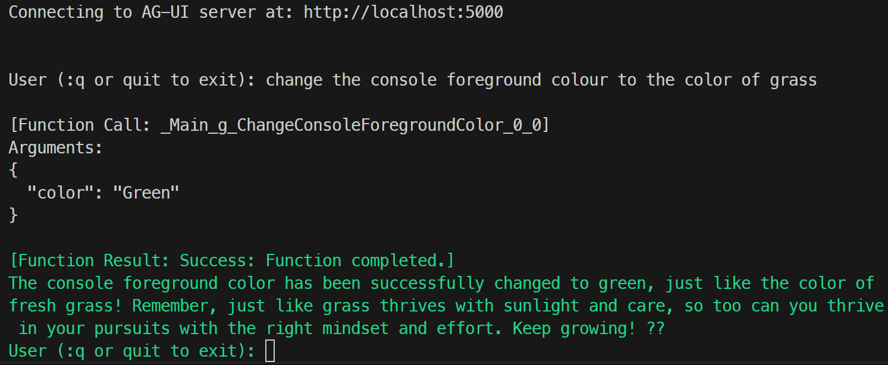
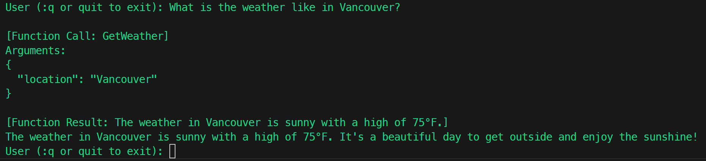

# Tools calling

## Creating client tools

``` C#
[Description("Change the console foreground color into the specified color.")]
void ChangeConsoleForegroundColor(string color)
{
    if (Enum.TryParse<ConsoleColor>(color, out var parsedColor))
    {
        Console.ForegroundColor = parsedColor;
    }
    else
    {
        Console.ForegroundColor = ConsoleColor.White;
    }
}

AIFunction changeConsoleForegroundColor = AIFunctionFactory.Create(ChangeConsoleForegroundColor);
```

add the tool to the agent:
``` C#
AGUIChatClient chatClient = new(httpClient, serverUrl);
AIAgent agent = chatClient.CreateAIAgent(
    name: "agui-client",
    description: "AG-UI Client Agent",
    tools: [changeConsoleForegroundColor]);
```

add instruction for the agent when using the client tool:
``` C#
List<ChatMessage> messages =
[
    new(ChatRole.System, "If you're asked to return a color for the console foreground, return from the enum of ConsoleColor, with CamelCase."),
];
```

add these two else-if conditions to the `AIContent` foreach loop so you'd know when the function is called, what arguments are passed in, and what result the function return:
``` C#
else if (content is FunctionCallContent functionCallContent)
    {       
        var argsJson = JsonSerializer.Serialize(
            functionCallContent.Arguments,
            new JsonSerializerOptions { WriteIndented = true }
        );
        Console.WriteLine($"\n[Function Call: {functionCallContent.Name}]\nArguments:\n{argsJson}");
    }
    else if (content is FunctionResultContent functionResultContent)
    {
        Console.WriteLine($"\n[Function Result: {functionResultContent.Result}]");
    }
```


run this to start the client again
``` bash
dotnet run
```

<details>

<summary>
here's an example of the interaction:
</summary>




</details>

## Calling backend tools

There's already a backend tool (that gets the weather) defined on the server. You can simply ask for the weather in the same console to call it.

<details>

<summary>
here's an example of the interaction:
</summary>




</details>