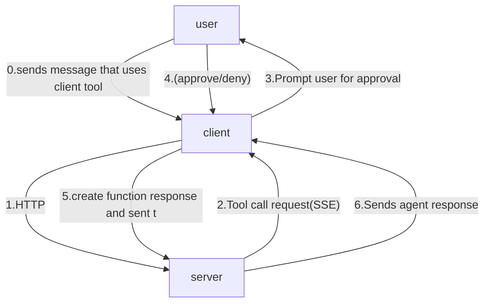

# Human-in-the-Loop

### Creating tools with that requires approval/human in the loop:

add this tool to the Program.cs in the client folder:
``` C#
[Description("Send an email to a recipient.")]
static string SendEmail(
    [Description("The email address to send to")] string to,
    [Description("The subject line")] string subject,
    [Description("The email body")] string body)
{
    return $"Email sent to {to} with subject '{subject}'";
}
```

make it an `AIFunction` that requires approval by wrapping it around `ApprovalRequiredAIFunction`:
``` C#
AIFunction approvalRequiredSendEmailTool = new ApprovalRequiredAIFunction(AIFunctionFactory.Create(SendEmail));
```

add the tool to the agent:
``` C#
AIAgent agent = chatClient.CreateAIAgent(
    name: "agui-client",
    description: "AG-UI Client Agent",
    tools: [changeConsoleForegroundColor, 
            approvalRequiredSendEmailTool]);
```

create a helper function that handles the approval response:
``` c#
async Task HandleFunctionApprovalResponse(AIAgent agent, ChatMessage message)
{
    var updates = agent.RunStreamingAsync(message);

    await foreach (AgentRunResponseUpdate update in updates)
    {
        foreach (AIContent content in update.Contents)
        {
            if (content is TextContent textContent)
            {
                Console.Write(textContent.Text);
            }
        }
    }
    awaitingApproval = false;
}
```

add this else-if condition to the `AIContent` foreach loop to take care of the function approval:
``` C#
else if (content is FunctionApprovalRequestContent request)
{
    var input = message.Trim().ToLowerInvariant();
    if (input == "approve" || input == "a" || input == "yes" || input == "y")
    {
        var approvalMessage = new ChatMessage(ChatRole.User, [request.CreateResponse(true)]);
        Console.ForegroundColor = ConsoleColor.Green;
        await HandleFunctionApprovalResponse(agent, approvalMessage);
        Console.ForegroundColor = currentColor;
    }
    else if (input == "deny" || input == "d" || input == "no" || input == "n")
    {
        var denialMessage = new ChatMessage(ChatRole.User, [request.CreateResponse(false)]);
        Console.ForegroundColor = ConsoleColor.Red;
        await HandleFunctionApprovalResponse(agent, denialMessage);
        Console.ForegroundColor = currentColor;
    }
    else
    {
        var argsJson = JsonSerializer.Serialize(
            request.FunctionCall.Arguments,
            new JsonSerializerOptions { WriteIndented = true }
        );
        Console.ForegroundColor = ConsoleColor.Blue;
        Console.WriteLine($"\nPlease confirm that you'd like to send the email with the following details:\n{argsJson}");
        Console.ForegroundColor = currentColor;
        awaitingApproval = true;
    }
}
```

### Using tools with approval:
run this to start the client again:

```
dotnet run
```

And you can simply ask it to send an email for you.

<details>
<summary>
here's an example of the interaction:
</summary>


</details>


<details>
<summary>
here's what's happening:
</summary>



when you sends a message that requires calling the tool that requires approval:
1. the client sends the message to server via HTTP
2. the server sends a tool call request back to client via SSE
3. the client prompts user for approval
4. user decides if they approve or deny the tool execution
5. client converts user's response into a function response and pass it to the server
6. the server incorporates the result into the agent context and returns the response back to the client
</details>