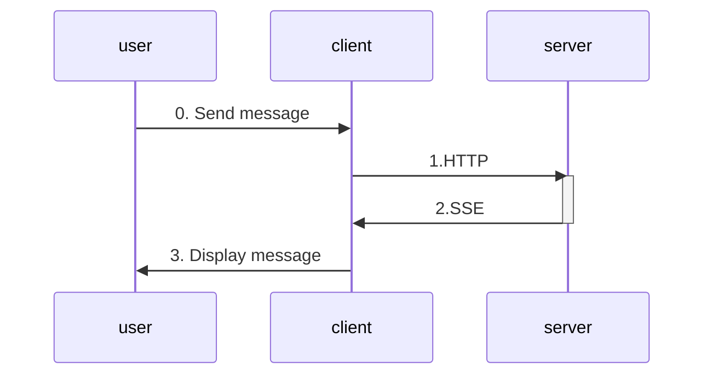

# Client Setup

### Setting up the client
``` bash
dotnet new console -o Client_Tutorial
```

cd into the directory, and run these to install the required packages

``` bash
cd Client_Tutorial
dotnet add package Microsoft.Agents.AI.AGUI --prerelease
dotnet add package Microsoft.Agents.AI --prerelease
```

replaced Program.cs with this
``` C#
using Microsoft.Agents.AI;
using Microsoft.Agents.AI.AGUI;
using Microsoft.Extensions.AI;

string serverUrl = Environment.GetEnvironmentVariable("AGUI_SERVER_URL") ?? "http://localhost:5000";
Console.WriteLine($"Connecting to AG-UI server at: {serverUrl}\n");

// Create the AG-UI client agent
using HttpClient httpClient = new()
{
    Timeout = TimeSpan.FromSeconds(60)
};

AGUIChatClient chatClient = new(httpClient, serverUrl);
AIAgent agent = chatClient.AsAIAgent(
    name: "agui-client",
    description: "AG-UI Client Agent");

List<ChatMessage> messages = [];
AgentSession session = await agent.GetNewSessionAsync();

ConsoleColor currentTextColor = Console.ForegroundColor;
Console.Write("\nEnter your message or :q to quit.\n");
string regularPrompt = "\n> ";

try
{
    while (true)
    {
        // Get and validate user input
        Console.Write(regularPrompt);
        string? message = Console.ReadLine();

        if (string.IsNullOrWhiteSpace(message))
        {
            Console.WriteLine("Request cannot be empty.");
            continue;
        }
        if (message.ToLowerInvariant() is ":q" or "quit")
        {
            break;
        }

        messages.Add(new ChatMessage(ChatRole.User, message));

        // Stream and print the response
        await foreach (AgentResponseUpdate update in agent.RunStreamingAsync(messages, session))
        {
            foreach (AIContent content in update.Contents)
            {
                if (content is TextContent textContent)
                {
                    Console.Write(textContent.Text);
                }
            }
        }
    }
}
catch (Exception ex)
{
    Console.WriteLine($"\nAn error occurred: {ex.Message}");
}
```

> [!TIP]
> if you're getting syntax error, check .csproj and make sure you're using the following versions:
> ```
> <PackageReference Include="Microsoft.Agents.AI" Version="1.0.0-preview.260128.1" />
> <PackageReference Include="Microsoft.Agents.AI.AGUI" Version="1.0.0-preview.260128.1" />
> ```
### Running the client

you can optionally set a custom server URL:
``` bash
export AGUI_SERVER_URL="http://localhost:8888"
```

run this to start the client
``` bash
dotnet run
```

<details>

<summary>
here's an example of the interaction:
</summary>


</details>

### What's happening?



when you send a message in the console:
1. the client relays it to the server via HTTP
2. the server responds to the client via Server-Sent Events (SSE)
3. the client displays it to you

