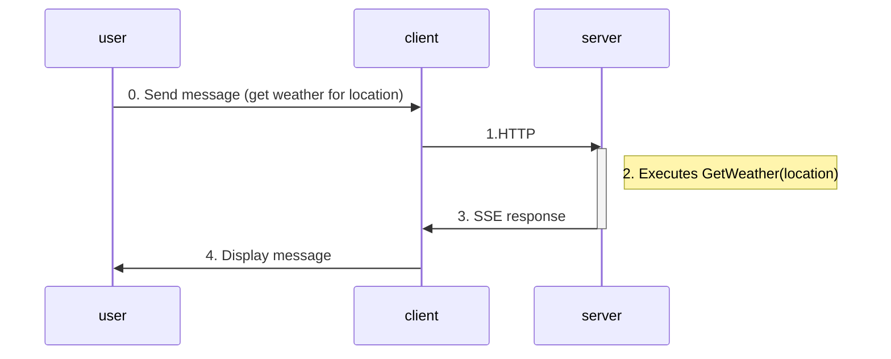
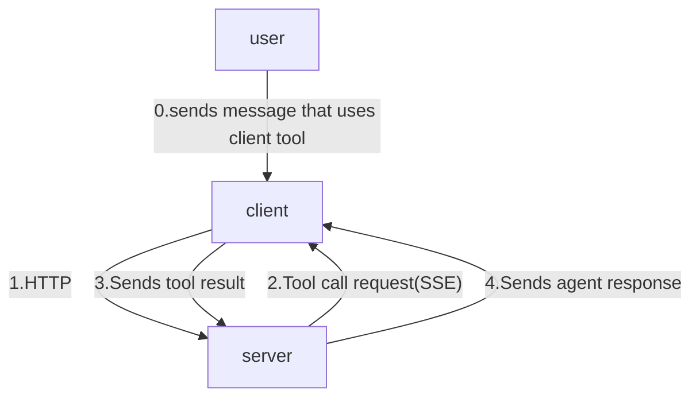

# Tools

## Backend tools

### Creating backend tools:

There's already a backend tool (that gets the weather) defined on the server. 

### Calling backend tools:

You can simply ask for the weather in the same console to call it.

<details>
<summary>
here's an example of the interaction:
</summary>


</details>

### What's happening?
here's what's happening:



when you sends a message to get weather for a location in the console:
1. the client relays it to server via HTTP
2. the agent on the server calls `GetWeather(location)` and incorporate the function result into the agent response
3. the server returns the response to the client via SSE
4. the client displays it to you


## Client tools

### Creating client tools:

add this tool to the Program.cs in the client folder:
``` C#
[Description("Change the console foreground color into the specified color.")]
void ChangeConsoleForegroundColor(string color)
{
    if (Enum.TryParse<ConsoleColor>(color, out var parsedColor))
    {
        currentColor = parsedColor;
        Console.ForegroundColor = parsedColor;
    }
    else
    {
        throw new ArgumentException($"Invalid console colour '{color}'", nameof(color));
    }
}
```

AIFunction changeConsoleForegroundColor = AIFunctionFactory.Create(ChangeConsoleForegroundColor);
make it an `AIFunction`:
``` C#
AIFunction changeConsoleForegroundColorTool = AIFunctionFactory.Create(ChangeConsoleForegroundColor);
```

add the tool to the agent [1]:
``` C#
AIAgent agent = chatClient.CreateAIAgent(
    name: "agui-client",
    description: "AG-UI Client Agent",
    tools: [changeConsoleForegroundColorTool]);
```

add instruction for the agent when using the client tool:
``` C#
List<ChatMessage> messages =
[
    new(ChatRole.System, "When asked to return a color for the console foreground, choose the closest one from the ConsoleColor enum and return with CamelCase."),
];
```

add these two else-if conditions to the `AIContent` foreach loop so you'd know when the function is called, what arguments are passed in, and what result the function return:
``` C#
                else if (content is FunctionCallContent functionCallContent)
                {                    
                    var argsJson = JsonSerializer.Serialize(
                        functionCallContent.Arguments,
                        new JsonSerializerOptions { WriteIndented = true }
                    );
                    Console.ForegroundColor = ConsoleColor.Blue;
                    Console.WriteLine($"\n[Function Call: {functionCallContent.Name}]\nArguments:\n{argsJson}");
                    Console.ForegroundColor = currentColor;
                }
                else if (content is FunctionResultContent functionResultContent)
                {
                    Console.WriteLine($"\n[Function Result: {functionResultContent.Result}]");
                }    
```
### Calling client tools:

run this to start the client again
``` bash
dotnet run
```

And you can simply ask for it to change the console foreground color.

<details>
<summary>
here's an example of the interaction:
</summary>


</details>


### What's happening?



the server doesn't know the implementation details of client side tools. it only knows:
1. tool names and description (from [1])
2. parameters schemas
3. when to request tool execution

when you sends a message that requires calling the client tool:
1. the client sends the message to server via HTTP
2. the server sends a tool call request back to client via SSE
3. the client sends the tool result back to server
4. the server incorporates the result into the agent context and returns the response back to the client