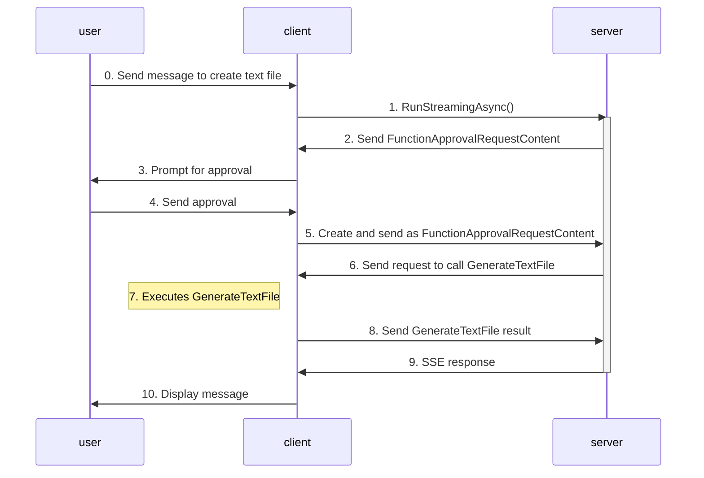

# Human-in-the-Loop

### Creating tools with that requires approval/human in the loop:

> [!TIP] 
> `FunctionApprovalRequestContent` and `ApprovalRequiredAIFunction` are for evaluation purposes only. 
> Create a .editorconfig file with the following content to suppress the syntax error so that you can proceed.
> In the folder where Program.cs is, create a .editorconfig file with this content:
> ```
> [*.cs]
> 
> # MEAI001: Type is for evaluation purposes only and is subject to change or removal in future updates. Suppress this diagnostic to proceed.
> dotnet_diagnostic.MEAI001.severity = none
> ```

add this tool to the Program.cs in the client folder:
``` C#
[Description("Generate a text file with the specified filename and content.")]
static string GenerateTextFile(
    [Description("The filename to generate")] string filename,
    [Description("The content to write to the file")] string content)
{
    string projectRoot = Path.GetFullPath(Path.Combine(AppContext.BaseDirectory, "..", "..", ".."));
    string filePath = Path.Combine(projectRoot, filename);

    File.WriteAllText(filePath, content);

    return $"File written to: {filePath}";
}
```

make it an `AIFunction` that requires approval by wrapping it around `ApprovalRequiredAIFunction`:
``` C#
AIFunction approvalRequiredSendEmailTool = new ApprovalRequiredAIFunction(AIFunctionFactory.Create(SendEmail));
```

add the tool to the agent:
``` C#
AIAgent agent = chatClient.CreateAIAgent(
    name: "agui-client",
    description: "AG-UI Client Agent",
    tools: [setTextColorTool, 
            generateTextFileTool]);
```

create a helper function that handles the approval response:
``` c#
async Task HandleFunctionApprovalResponse(AIAgent agent, ChatMessage message)
{
    await foreach (AgentResponseUpdate update in agent.RunStreamingAsync(message))
    {
        Console.Write(update.Text);
    }
    awaitingApproval = false;
}
```

add this else-if condition to the `AIContent` foreach loop to take care of the function approval:
``` C#
                else if (content is FunctionApprovalRequestContent request)
                {
                    var input = message.Trim().ToLowerInvariant();
                    if (input == "approve" || input == "a" || input == "yes" || input == "y")
                    {
                        var approvalMessage = new ChatMessage(ChatRole.User, [request.CreateResponse(true)]);
                        Console.ForegroundColor = ConsoleColor.Green;
                        await HandleFunctionApprovalResponse(agent, approvalMessage);
                        Console.ForegroundColor = currentColor;
                    }
                    else if (input == "deny" || input == "d" || input == "no" || input == "n")
                    {
                        var denialMessage = new ChatMessage(ChatRole.User, [request.CreateResponse(false)]);
                        Console.ForegroundColor = ConsoleColor.Red;
                        await HandleFunctionApprovalResponse(agent, denialMessage);
                        Console.ForegroundColor = currentColor;
                    }
                    else
                    {
                        var argsJson = JsonSerializer.Serialize(
                            request.FunctionCall.Arguments,
                            new JsonSerializerOptions { WriteIndented = true }
                        );
                        Console.ForegroundColor = ConsoleColor.Blue;
                        Console.WriteLine($"\nPlease confirm that you'd like to send the email with the following details:\n{argsJson}");
                        Console.ForegroundColor = currentColor;
                        awaitingApproval = true;
                    }
                }
```

### Using tools with approval:
run this to start the client again:

```
dotnet run
```

And you can simply ask it to create a text file for you

<details>
<summary>
here's an example of the interaction:
</summary>


</details>


### What's happening?



When you send a message to generate text file:
1. the client relays it to the server via HTTP
2. the server sends a request to prompt user for approval to the client as `FunctionApprovalRequestContent`
3. the client prompts the users for approval
4. the user decides if they approve or deny the toll execution
5. the client converts user's response into a `FunctionApprovalRequestContent` and sends it to the server
6. the server sends the tool call request to client
7. the client calls `GenerateTextFile` with the appropriate arguments from the server
8. the client sends the result from `GenerateTextFile` back to the server
9. the server incorporates the result into the agent response and returns it back to the client via SSE
10. the client display it to you